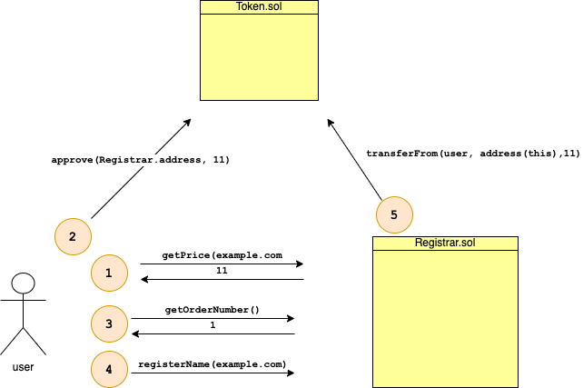

# Solidity Name Registering System for Ethereum
- [Solidity Name Registering System for Ethereum](#solidity-name-registering-system-for-ethereum)
	- [1. About](#1-about)
	- [2. Project description](#2-project-description)
	- [3. Smart contracts](#3-smart-contracts)
		- [Registrar.sol](#registrarsol)
		- [Token.sol](#tokensol)
	- [4. Install](#4-install)
	- [5. Running tests](#5-running-tests)
		- [Testing in Ganache](#testing-in-ganache)
		- [Testing in Kovan](#testing-in-kovan)
	- [6. Unit test expected output](#6-unit-test-expected-output)
	- [7. TO DO](#7-to-do)

## 1. About
This repository contains the source code and dependencies required to deploy a Solidity based vanity name registering system resistant against frontrunning. 

## 2. Project description

The diagram below shows a high level overview with the main components and logic flow



## 3. Smart contracts
The smart contracts contained in the project are:

### Registrar.sol

Implements the business logic for the registration of 'names'

Exposes 5 main functions
- `getOrderNumber` returns the 'order' number that allows user to register 'names'
- `registerName` is used to register a new 'name'. Caller should have a valid order number (i.e. not expired)
- `renewName` is used by caller to keep name registered (i.e. when not expired yet)
- `unlockBalance` is used by caller to unlock token balance after 'name' registration has expired
- `getPrice` returns the price for the provided 'name' as a function of its length

### Token.sol

ERC20 standard token

Token funds should be provided in order to register a 'name'

## 4. Install
Truffle and Ganache are required to deploy and test this project.

They can be installed by running:
```
$ npm install -g truffle
$ npm install -g ganache-cli
```
Clone the repository and install dependencies:
```
$ npm install
```
## 5. Running tests

This project includes a test suite based in Truffle/Mocha.

Tests can be run on local Ganache or on Kovan test network.

### Testing in Ganache
To run test in Ganache environment, a Ganache instance must be running on port 7545

You can start Ganache by executing the following:
```
$ ganache-cli -p 7545
```
To execute test suite, on a different terminal run:
```
truffle test --network development
```
### Testing in Kovan
The following is required to run test cases in Kovan network

=> infura account

API project KEY from https://infura.io enabled on KOVAN endpoint

=> Kovan ether funds available

At least 2 funded accounts are needed to run the tests in Kovan network.

Ether funds in Kovan can be requested via Kovan faucet: https://faucet.kovan.network/

=> `.env` file

Truffle reads the kovan accounts and infura API KEY from a plain text .env file located in root folder.

The .env file should define MNEMONIC and INFURA_APIKEY as environment variables:
```
MNEMONIC="<your mnemonic seed phrase that derives Kovan addresses with funds>"
INFURA_APIKEY="<your valid infura API key>"
```
To execute test suite on Kovan run:
```
truffle test --network kovan
```
## 6. Unit test expected output

```javascript
  Contract: Registrar
    Use Case 1: USER1 registers a new name 'example.com' 
      ✓ should provide price corresponding to 11 characters: 'example.com'
      ✓ should provide a order number to user and front runner (236ms)
      ✓ should allow front runner to register 'example.com' (356ms)
      ✓ should allow user to register 'example.com' after front runner (359ms)
      ✓ should revert when front runner attemps to register 'example.com' (1923ms)
    Use Case 2: USER2 registers 'example.com' after it expires
      ✓ should revert when attempting registration without order number (337ms)
      ✓ should revert when attempting registration if registered name is not expired (724ms)
--------------------
Simulating expiration of 'order number' for USER2
waiting 4 seconds
waiting 3 seconds
waiting 2 seconds
waiting 1 seconds
---------------------
      ✓ should revert when attempting registration with expired order number (4557ms)
--------------------
Simulating expiration of name 'example.com' for USER1
waiting 10 seconds
waiting 9 seconds
waiting 8 seconds
waiting 7 seconds
waiting 6 seconds
waiting 5 seconds
waiting 4 seconds
waiting 3 seconds
waiting 2 seconds
waiting 1 seconds
---------------------
      ✓ should allow registration after registration has expired (10526ms)
    Use Case 3: USER2 issues renewal of 'example.com' renewal and USER1 unlocks balance
      ✓ should allow current owner USER2 to renew 'example.com' before expiration (151ms)
    Use Case 4: USER2 unlocks balance
--------------------
Simulating expiration of name 'example.com' for USER2
waiting 10 seconds
waiting 9 seconds
waiting 8 seconds
waiting 7 seconds
waiting 6 seconds
waiting 5 seconds
waiting 4 seconds
waiting 3 seconds
waiting 2 seconds
waiting 1 seconds
---------------------
      ✓ should allow original owner USER1 to unlock balance after registration expired (10201ms)


  11 passing (30s)
```
## 7. TO DO
- Allow single user to register multiple names
- Gas limit to enhance prevention of front running
- Use safemath lib
- Use off chain scheduling
- Improve test suite coverage
- Gas optimization
- Improve README.md